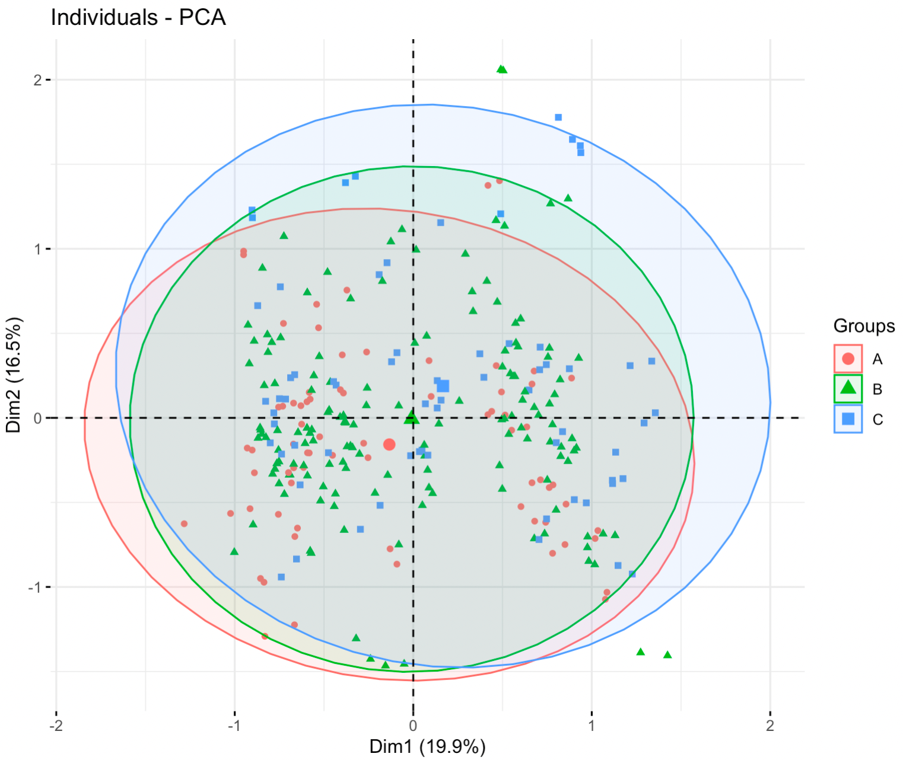

# PCA tutorial

The following code can be used to generate the PCA plot. 

```R
library('tidyverse')
library('readxl')
library('heatmaply')
library('pheatmap')
library('factoextra')

read_excel('Data/<FILE_NAME>.xlsx', # replace <FILE_NAME> with the name of your results spreadsheet (do not remove the enclosing single quotation marks)
           sheet='<SHEET_NAME>') %>% # replace <SHEET_NAME> with the name of sheet where you have your data (do not remove the enclosing single quotation marks)
    normalize(<COLUMN_OF_FIRST_PEAK>:<COLUMN_OF_LAST_PEAK>) %>% # replace <COLUMN_OF_FIRST_PEAK> with the column number of the first peak, replace <COLUMN_OF_LAST_PEAK> with the column number of the last peak
    dplyr::select(<COLUMN_OF_SAMPLE_NAMES>, <COLUMN_OF_FIRST_PEAK>:<COLUMN_OF_LAST_PEAK>) %>% #replace <COLUMN_OF_SAMPLE_NAMES> with the column number of the column where you stored your sample names, replace <COLUMN_OF_FIRST_PEAK> with the column number of the first peak, replace <COLUMN_OF_LAST_PEAK> with the column number of the last peak
    column_to_rownames('<COLUMN_NAME_OF_SAMPLE_NAMES>') %>% #replace <COLUMN_OF_SAMPLE_NAMES> with the column number of the column where you store your sample names (do not remove the enclosing single quotation marks)
    prcomp(scale=F) %>% 
    fviz_pca_ind(
        label='none',
        habillage=read_excel('Data/<FILE_NAME>.xlsx', # replace <FILE_NAME> with the name of your results spreadsheet, do not remove the enclosing single quotation marks
                             sheet='<SHEET_NAME>')$<COLUMN_NAME_OF_GROUP_NAMES>, # replace <SHEET_NAME> with the name of sheet where you have your data (do not remove the enclosing single quotation marks), replace <COLUMN_NAME_OF_GROUP_NAMES> with the name of the column where you store your grouping information
        addEllipses=T
    )
```

Notes when implementing the code with your own data:

- You need to create a folder called `Data` under your parent directory

- You need to save a Excel file (.xlsx format) where you have all you data (including sample names, peak intensities, peak names, grouping information)

- Your data structure should be organised similar to this (suppose the last peak is peak 30)

- | Sample_name | Group | Peak_1 | ...... | Peak_30 |
  | ----------- | ----- | ------ | ------ | ------- |
  | XXX.mea     | A     | ...... | ...... | ......  |
  | XXX.mea     | B     | ...... | ...... | ......  |
  | XXX.mea     | B     | ...... | ...... | ......  |
  | XXX.mea     | C     | ...... | ...... | ......  |

  You are advised agaist having spaces in your column names and spaces should ideally be replaced with underscores, e.g., `sample_name` is preferred over `sample name`


A sample output looks like this:


