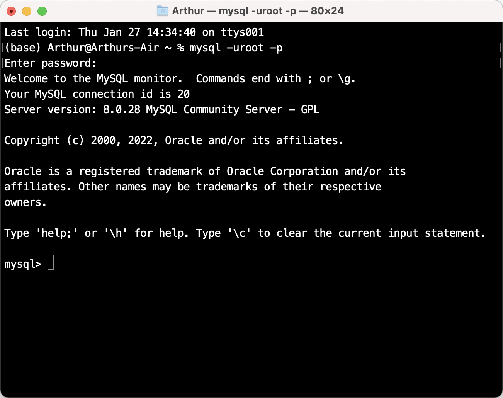

# How to install MySQL on macos

  - MySQL can be downloaded from [MySQL website](https://dev.mysql.com/downloads/mysql/). Choose the "macOS 11 (ARM, 64-bit), DMG Archive" version for Apple silicon.
  - When installing, setting a password for `root` user will be prompted.
  -  After installation, mysql needs to be firstly added to `$PATH`.

## Adding MySQL to `$PATH` (zsh shell)

Original post can be found [here](https://code2care.org/pages/permanently-set-path-variable-in-mac-zsh-shell).

	- Open terminal, type `nano ~/.zshrc`. Hit enter.
	- Add `$PATH` variable details: `export PATH="$PATH:/usr/local/mysql/bin"`.
	- Press `Control + X`, followed by `Y` to save the file, press enter to exit `nano`.
	- Type command `source ~/.zshrc` to apply changes.

## Accessing MySQL through terminal

- Open terminal, enter `mysql -uroot -p`.
- Enter the password for `root` user.
- You should now see this screen.

- If you see the above information, then the installation has succeeded.
